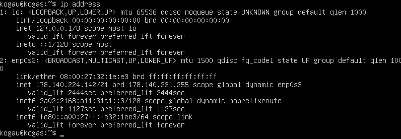
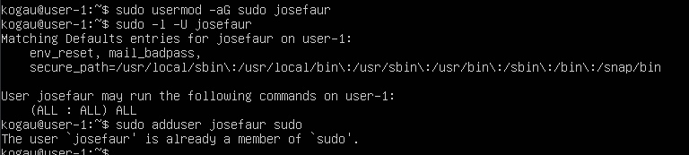
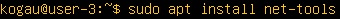

## Part 1. Установка ОС

1. Чтобы узнать версию ОС, необходимо выполнить команду:\
`cat /etc/issue`

## Part 2. Создание пользователя

1. Создание пользователя:

2. Добавление пользователя в группу adm:

3. Проверка, к каким группам относится пользователь:

## Part 3. Настройка сети ОС

1. Название машины по умолчанию:\
`hostnamectl`

2. Задаём название машины:\
`sudo hostname user-1`

3. Временна зона по умолчанию:\
`timedatectl`

4. Установка временной зоны и проверка:\
`timedatectl list-timezones | grep Europe/Moscow`
`sudo timedatectl set-timezone Europe/Moscow`\
`timedatectl`

4. Вывод названий сетевых интерфейсов:\
`ls /sys/class/net`

lo (loopback device) это виртуальный(локальный) интерфейс, присутствующий по умолчанию в любых UNIX-системах. Он может быть использован сетевым клиентским программным обеспечением, чтобы общаться с серверным приложением, расположенным на том же компьютере. С этим интерфейсом всегда связан адрес 127.0.0.1. У него есть dns-имя – localhost.

5. Получение IP-адреса от DHCP:\
`ip address`

DHCP (Dynamic Host Configuration Protocol) это протокол клиента или сервера, который нужен для автоматического присвоения IP с его IP-адресом и другими сведениями такими как подсети и шлюз по умолчанию.

5. Определение внешнего и внутреннего IP-адреса шлюза:\
`ip route`

6. Задание статичных сетевых настроек

Для задания статического IP-адреса, шлюза и DNS, необходимо отредактировать YAML-файл в директории /etc/netplan/:\
`sudo nano /etc/netplan/00-installer-config.yaml`

После сохранения файла и применения новых настроек, выполняем следующую команду для применения конфигурации:\
`sudo netplan apply`

7. Перезагрузка виртуальной машины:\
`sudo reboot`

8. Проверяем, что статические настройки сохранены:\
`ip addr show`\
`ip route`

9. Проверяем доступность хостов командами:\
`ping -c 10 ya.ru`\
`ping -c 10 1.1.1.1`

## Part 4. Обновление ОС

1. Обновляем список пакетов командой:\
`sudo apt update`

2. Обновляем все установленные пакеты командой:\
`sudo apt upgrade`

## Part 5. Использование команды **sudo**
1. Истинное назначение команды sudo

Sudo (SuperUser DO) позволяет пользователю выполнять команды с привилегиями суперпользователя (root). Это позволяет администраторам системы и другим пользователям выполнять специфические задачи, требующие повышенных привилегий, например, установку программ или изменение системных файлов. 

2. Выдаём пользователю root права и проверяем их наличие:\
`sudo usermod -aG sudo josefaur`
`sudo -l -U josefaur`

4. Переключаем пользователя на toastgra и меняем hostname:\
`sudo su - josefaur`\
`sudo hostname user-3`

5. Также нужно поменять hostname в файле /etc/hostnames и выполнить перезагрузку, чтобы изменения вступили в силу:\
`sudo nano /etc/hostname`\
`sudo reboot`

## Part 6. Установка и настройка службы времени

1. Проверка настроек синхронизации времени:\
`timedatectl show`

## Part 7. Установка и использование текстовых редакторов 

1. Установка текстовых редакторов:\
`sudo apt install vim`\
`sudo apt install mcedit`

2. Создаём и открываем файл командой:\
`vim test_vim.txt`\
`i` - переключение в режим ввода\
`Esc` - переключение в командный режим\
`:wq` ,а затем `Enter` - выход с сохранением

3. Создаём и открываем файл командой:\
`nano test_nano.txt`\
`Ctrl+O` - сохранение\
`Enter` - подтверждение имени файла\
`Ctrl+X` - выход

4. Создаём и открываем файл командой:\
`mcedit test_edit.txt`\
`F2` - сохраниение\
`Enter` - подтверждение\
`F10` - выход

5. Редактирование и выход без сохраниения:
- vim:
  - `:q!` - выход без сохраниеня

  

- nano:
  - `Ctrl+X` + `n` - выход и отказ от сохранения

  

- mcedit:
  - `F10` + `[NO]` - выход и отказ от сохранения

  

6. Поиск и замена слова:
- vim:
  - `/слово` - поиск

  

  - `:s/слово/замена` - замена  

  

  

- nano:
  - `Ctrl + W` - поиск

  

  

  - `Ctrl + \` - замена
  - `Enter`  

  

  

  

- mcedit:
  - `F7` - поиск

  

  

  - `F4` - замена  

  

  

## Part 8. Установка и базовая настройка сервиса **SSHD**

1. Установка службы SSHD:\
`sudo apt update`\
`sudo apt install openssh-server`

2. Добавление автозапуска службы SSHD:\
`sudo systemctl enable ssh`\:
`systemctl status ssh` - проверка статуса

3. Перенастройка службы SSHD на порт 2022:\
`sudo mcedit /etc/ssh/sshd_config` - редактирование файла:
    - #Port 22 меняем на Port 2022

`sudo systemctl restart ssh` - перезагрузка службы

4. Проверка работы SSHD с помощью команды ps:\
`ps -A | grep sshd`

`ps` - отображает информацию о паботающих процессах

Основные ключи команды ps:\
-e: Показывает все процессы в системе.\
-u: Показывает информацию о пользователях, запустивших процессы.\
-x: Показывает процессы, которые не связаны с терминалом.\
-f: Форматирует вывод более подробным образом, включая полный путь к исполняемому файлу и информацию о родительском процессе.\
-l: Показывает дополнительную информацию, такую как владелец процесса, группа, размер памяти и т.д.\
-a: Аналогично ключу -x, показывает процессы, не связанные с терминалом.\
-A: Показывает все процессы в системе, независимо от того, кто их запустил.\
-m: Показывает только процессы, связанные с сетью.\
-n: Не показывает процессы, которые не имеют идентификаторов процесса.\
-o: Позволяет пользователю определить формат вывода с помощью списка полей.

5. Перезагрузка системы:\
`sudo reboot`

6. Устанавливаем netstat:\
`sudo apt install net-tools`

Вывод комманды:\
`sudo netstat -tan`

Ключ -t отображает только TCP сокеты\
Ключ -a отображает все сокеты (listening and non-listening)\
Ключ -n отображает адреса и порты вместо имен

Объяснение вывода netstat -tan:\
Proto: Протокол, используемый для соединения. Например, tcp или udp.\
tcp: Тип протокола.\
Recv-Q: Количество байтов, ожидающих прием в сокет. Это количество данных, которое еще не было прочитано приложением.\
Send-Q: Количество байтов, ожидающих отправку из сокета. Это количество данных, которое еще не было отправлено сетью.\
0 0: Стандартные значения, указывающие, что данные не отправлялись или не получены.\
Local Address: Локальный адрес и порт, на котором прослушивается соединение. 0.0.0.0 означает, что сокет прослушивает на всех доступных сетевых интерфейсах.\
0.0.0.0:2022: IP-адрес и порт, на котором прослушивается соединение. 0.0.0.0 означает, что сервер принимает соединения на указанном порту с любого IP-адреса.\
Foreign Address: Адрес и порт удаленного хоста, с которым установлено соединение. Если соединение не установлено, этот столбец может быть пустым.\
State: Состояние соединения.\
LISTEN: Состояние сокета, указывающее, что сервер готов принимать входящие соединения.

## Part 9. Установка и использование утилит **top**, **htop**

1. Вывод команды top:\
`sudo top`

  - `7min` uptime
  - `1 user` количество авторизованных пользователей
  - `0.00, 0.05 0.05(загрузка системы за последние 1, 5 и 15 минут)` общая загрузка системы
  - `123 total` общее количество процессов
  - `0.0 us, 0.1 sy, 0.0 ni, 99.0 id, 0.0 wa, 0.0 hi, 0.0 si, 0.0 st` загрузка cpu
  - `3919.5 total, 3452.4 free, 167.3 used, 299.8 buff/cache` загрузка памяти
  - `1` pid процесса занимающего больше всего памяти
  - `1` pid процесса, занимающего больше всего процессорного времени

2. Вывод команды htop:\
`sudo htop`\
`F6` - сортировка
  - сортировка по PID
  
  
  
  - PERCENT_CPU
  
  
  
  - PERCENT_MEM
  
  
  
  - TIME

  

  - фильтр для процесса sshd

  `F4`

  

  - с процессом syslog, найденным, используя поиск

  

  - с добавленным выводом hostname, clock и uptime

  `F2`

  

## Part 10. Использование утилиты **fdisk**

1. Выполняем команду:\
`sudo fdisk -l`

- Название жесткого диска: /dev/sda
- Размер жесткого диска: 15 GiB
- Количество секторов: 31457280 секторов
- Размер swap-пространства: 0 B

## Part 11. Использование утилиты **df** 
1. `sudo df`

- Размер раздела: 10218772 килобайт
- Размер занятого пространства: 3264184 килобайт
- Размер свободного пространства: 6413916 килобайт
- Процент использования: 34%
- Единица измерения: килобайт

2. `sudo df -Th`

- Размер раздела: 9.8 ГБ
- Размер занятого пространства: 3.2 ГБ
- Размер свободного пространства: 6.2 ГБ
- Процент использования: 34%
- Тип файловой системы: ext4

## Part 12. Использование утилиты **du**

1. `du`

2. Размер папок /home, /var, /var/log (в байтах, в человекочитаемом виде)\
`sudo du -hsb /var`\
`sudo du -hsb /var/log`\
`sudo du -hsb /home`

- -s означает "сводный", т.е. выводит общий размер директории
- -b означает "в байтах", т.е. выводит размер в байтах без преобразования в человекочитаемый вид
- -h означает "человекочитаемый", т.е. выводит размер в удобных для восприятия единицах (например, KB, MB, GB)

3. Размер всего содержимого в /var/log\
`sudo du -h /var/log/*` 

## Part 13. Установка и использование утилиты **ncdu**

1. Установка утилиты:\
`sudo apt install ncdu`

2. Вывод размера папок /home, /var, /var/log:

`ncdu /home`

`ncdu /var`

`ncdu /var/log`

## Part 14. Работа с системными журналами

1. Для просмотра логов вводим команды:

`cat /var/log/dmesg` - содержит сообщения ядра Linux, включая информацию о загрузке оборудования и других низкоуровневых событий\
`cat /var/log/syslog` - содержит системные сообщения, включая информацию о работе служб и приложений\
`cat /var/log/auth.log ` - содержит информацию о событиях аутентификации, включая попытки входа в систему и успешные авторизации

2. Последняя успешная авторизация:

`cat /var/log/auth.log | grep 'session opened'`

Время: 14:17:02\
Имя: root\
Метод: (uid=0) означает, что сессия была открыта для другого пользователя системой или процессом, работающим с правами суперпользователя.

3. Перезагрузка SSHD:

`sudo systemctl restart sshd`

`cat /var/log/syslog`

## Part 15. Использование планировщика заданий **CRON**

1. Добавляем задание в cron:

`crontab -e`

Добавляем строку `*/2 * * * * uptime` в конец файла.

2. Ищем в журнале строчки о выполнении:

`journalctl | grep 'uptime'`

3. Список текущих заданий:

`crontab -l`

4. Удаление всех заданий:

`crontab -r`

